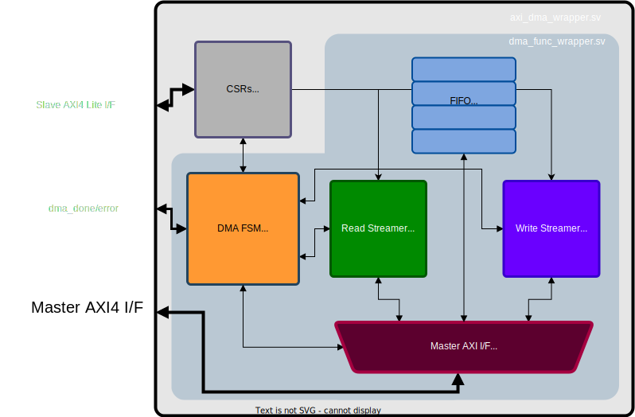

[](https://github.com/aignacio/axi_dma/actions/workflows/regression.yaml)
[](https://codecov.io/gh/aignacio/axi_dma)


# AXI DMA (Direct Memory Access)

## Table of Contents
* [Introduction](#intro)
* [Run tests](#test)
* [uArch](#uarch)
* [CSRs](#csrs)
* [License](#lic)

## <a name="intro"></a> Introduction
AXI DMA is a general purpose direct memory access IP using [AXI4 AMBA](https://developer.arm.com/documentation/ihi0022/e/AMBA-AXI3-and-AXI4-Protocol-Specification) interface with the following features:

- AXI4-Lite `Slave` interface to program the CSRs (Control and Status registers)
- AXI4 `Master` interface to fetch/read and write data
- Support for unaligned xfers (see below)
- Configurable number of descriptors (default to 2)
- Abort processing available
- Transfers up to 4GB of data per descriptor
- Two modes of data access, **Fixed** [FIFO] and **Incremental**
- Programmable number of bursts, to support simpler slaves
- Status of error during DMA operation 
- Configurable `bus width` option between 32-bit / 64-bit

*Read the [microarchitecture](#uarch) section to understand the unaligned access restriction.*

## <a name="test"></a> Run tests
This repository contains a set of tests implementing different types of scenarios using the `AXI DMA`. The tests were developed using [Cocotb](https://github.com/cocotb/cocotb) project and [Verilator](https://github.com/verilator/verilator). The list of tests can be found [here](#testlist). To run all the tests and generate the waveforms, please run the following command, the only requirements are `make` and [`docker`](https://docs.docker.com/engine/install/ubuntu/).
```bash
make run
```
Once finished, you should be able to open the logs and the generated waveforms at `run_dir`. This project makes use of [Rggen](https://github.com/rggen/rggen) project for CSR generation and the input file is the `csr_dma.xlsx` excel sheet.

### <a name="testlist"></a> Test list

Here is listed all the tests that were implemented to check the DMA features. Although it does not check all possible combinations, it covers most of the basic usage and possible options. The `variants` are the additional runs of the same tests but with different scenarios like idle cycles and backpressure on the bus. For the `Flavors`, there are three types which 32b maps to `AXI_ADDR/DATA_WIDTH == 32 bits` and 64b to `AXI_ADDR_WIDTH == 32 bits` / `AXI_DATA_WIDTH == 64 bits`, the `small` flavor stands for a reduced dma 32b version with 8x beats burst, non-support for unaligned txns and no max burst control.

| **No** |     **Test name**    |                  **Quick description**                 |             **Variants**            | **Flavor** |
|:------:|:--------------------:|:------------------------------------------------------:|:-----------------------------------:|:----------:|
|    1   |     test_dma_csrs    |        Run some simple write/read in the RW CSRs       | idle_inserter/backpressure_inserter |   32b/64b  |
|    2   | test_dma_single_desc |       Move 4KB of data using a single descriptor       | idle_inserter/backpressure_inserter |   32b/64b  |
|    3   |  test_dma_full_desc  |    Programs all descriptors with different addresses   | idle_inserter/backpressure_inserter |   32b/64b  |
|    4   |    test_dma_abort    |        Assert the abort CSR during DMA operation       |                  --                 |   32b/64b  |
|    5   |  test_dma_max_burst  |     Configures all possible bursts through the DMA     |                  --                 |   32b/64b  |
|    6   |    test_dma_error    |       Checks if AXI error was captured correctly       |                  --                 |   32b/64b  |
|    7   |    test_dma_modes    |   Check for the different running modes / INCR/FIXED   |                  --                 |   32b/64b  |
|    8   |  test_dma_unaligned  | Test different unaligned addresses in the descriptors. |                  --                 |   32b/64b  |


## <a name="uarch"></a> Microarchitecture
The `AXI DMA` microarchitecture is quite simple without anything complex to understand, the design is divided in two main flows, read and write data path. The block in violet is auto-generated using [Rggen](https://github.com/rggen/rggen) and it contains all the CSRs used and the other modules are original designs.

Starting by the [`DMA FSM`](rtl/dma_fsm.sv), it controls the managing of processing all the descriptors by the [`Streamers`](rtl/dma_streamer.sv), thus dispatching new ones as soon as it each streamers finishes with the transfer. The `streamers` are responsible for breaking the transactions into multiple `AXI` transfers respecting the protocol as 4KB address boundary or the numbers of bursts per burst type, i.e 16-FIFO / 256-INCR. On the [`Master AXI I/F`](rtl/dma_axi_if.sv), it waits for requests from the `streamers` and if available, it tries to dispatch through the correspondent address channel till the maximum of outstanding transfers defined in the included file ([rd](https://github.com/aignacio/axi_dma/blob/master/rtl/inc/dma_pkg.svh#L24)/[wr](https://github.com/aignacio/axi_dma/blob/master/rtl/inc/dma_pkg.svh#L28)).

As the main buffer for the data that is read and written through the DMA, the [`FIFO`](rtl/dma_fifo.sv) can be [configured](https://github.com/aignacio/axi_dma/blob/master/rtl/inc/dma_pkg.svh#L33) to any size in depth with `width` equal to the AXI data bus width. 

### Unaligned access support
Although the DMA can be programmed with unaligned source/dest addresses, the support for unaligned is limited to the bus width i.e the smallest xfer through rd/wr channel must match the defined AXI bus width and internal masking will be applied to match the source/dest addresses. Thus it is up to the user to correctly program the descriptors considering symmetric alignment in the src/dest address. This is a design decision to simplify the interface between the modules and fine grain memory moving can usually be done by CPUs instead of a DMA.

## <a name="csrs"></a> CSRs - Control & Status Registers
For more details on the CSRs like address and access policy, please read the generated file available at [CSR list](csr_out/csr_dma.md). 

## <a name="lic"></a> License
`AXI DMA` is licensed under the permissive MIT license. Please refer to the [LICENSE](LICENSE) file for details.
